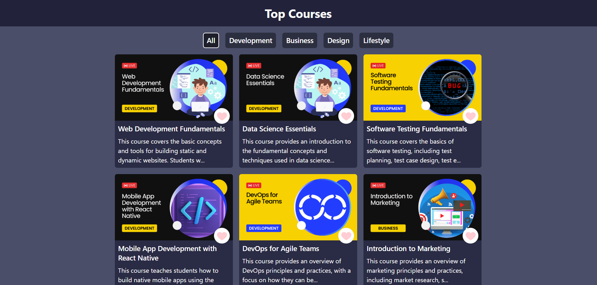
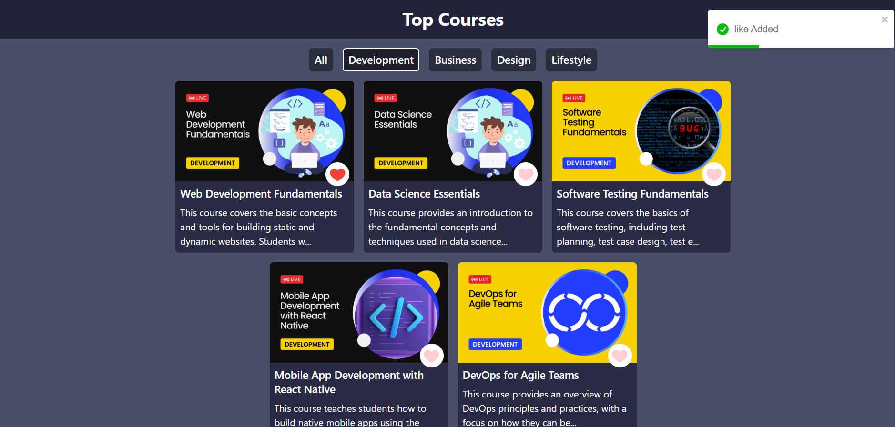

# 📚 Top Courses App

A responsive React web app that fetches and displays popular courses from an API. Users can browse by category and "like" courses they find interesting — a great UI practice project using modern React concepts.

## 📸 Screenshots

### 💻 Home Page


### 📂 Filtered Category


## ✨ Features

- ✅ Fetches course data from an external API
- 🎯 Category-based filtering
- ❤️ Like/Unlike functionality with feedback using Toast notifications
- 🚀 Loading spinner while fetching data
- 🎨 Fully responsive and styled with Tailwind CSS

## 🛠️ Tech Stack

- React.js
- Tailwind CSS
- React Toastify
- Fetch API

## 📁 Project Structure

```bash
.
├── App.js
├── components
│   ├── Cards.jsx
│   ├── Card.jsx
│   ├── Filter.jsx
│   ├── Navbar.jsx
│   └── Spinner.jsx
├── data.js
└── styles.css
```

## ⚙️ Getting Started

### 1. Clone the repo
```bash
git clone https://github.com/abhimittal1/Top-Courses-Project.git
cd top-courses-app
```

### 2. Install dependencies
```bash
npm install
```

### 3. Run the project
```bash
npm start
```

## 🔗 Dependencies

- `react-toastify`: For toast notifications
- `react-icons`: For like icons
- `tailwindcss`: For styling


## 🙌 Acknowledgements

Thanks to **CodeHelp by Love Babbar Bhaiya** for guidance and inspiration throughout the learning journey. ❤️

---

## 📬 Contact

For feedback or suggestions, reach out to me on email at abhishekmittal24gold@gmail.com.
```

